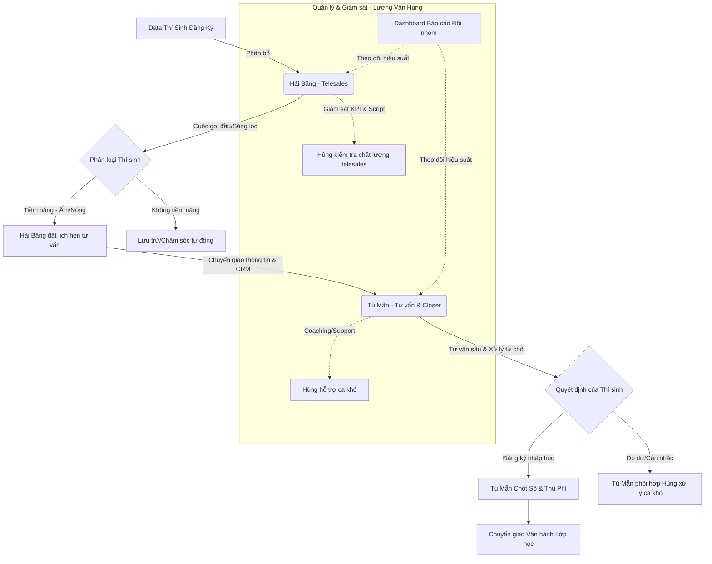

# BẢN PHÂN CÔNG CÔNG VIỆC & QUY TRÌNH QUẢN LÝ THÍ SINH
**Đội nhóm:** Nhóm Tư vấn Tuyển sinh  
**Trưởng nhóm (Lead):** Lương Văn Hùng  
**Thành viên:** Tú Mẫn (Chuyên viên Tư vấn/Closer), Hải Băng (Chuyên viên Telesales)  

---

## 1. Sơ Đồ Quy Trình Phễu Chuyển Đổi Thí Sinh (Pipeline)

Quy trình phối hợp khép kín từ khâu tiếp cận ban đầu đến khi thí sinh nhập học thành công:

---

## 2. Bảng Phân Công Công Việc Chi Tiết (RACI Matrix)

Bảng phân vai nhiệm vụ dựa trên thế mạnh của từng nhân sự và lồng ghép **kế hoạch IDP phát triển năng lực quản lý của Trưởng nhóm Lương Văn Hùng**:

### A. Lương Văn Hùng — Trưởng nhóm Tư vấn (Lead)
Vai trò chính là quản trị, lập kế hoạch, và kèm cặp (coaching) đội ngũ để tối ưu hóa tỷ lệ chuyển đổi.

*   **Lập kế hoạch & Phân bổ (K5 - Quản trị):**
    *   Xác định chỉ tiêu tuyển sinh (KPI số lượng thí sinh nhập học) hàng tháng/tuần cho nhóm.
    *   Phân bổ data thí sinh hợp lý cho Hải Băng (Telesales) dựa trên năng lực xử lý.
*   **Giám sát & Đào tạo (S4 - Quản lý & Coaching):**
    *   *Kèm cặp trực tiếp Hải Băng (Telesales):* Nghe lại ghi âm cuộc gọi, sửa kịch bản (script) nói chuyện để tăng tỷ lệ hẹn gặp.
    *   *Hỗ trợ Tú Mẫn (Closer):* Tham gia trực tiếp vào các ca tư vấn thí sinh VIP hoặc các ca khó bị từ chối để hỗ trợ chốt số.
*   **Báo cáo & Phân tích (S3 - Phân tích dữ liệu):**
    *   Xây dựng báo cáo tuần/tháng theo dõi tỷ lệ chuyển đổi của phễu: $Data \rightarrow Kết\ nối \rightarrow Hẹn\ gặp \rightarrow Chốt\ số$.
    *   Đưa ra đề xuất cải tiến quy trình vận hành CRM của nhóm.

---

### B. Hải Băng — Chuyên viên Telesales
Vai trò chính là người tiếp xúc đầu tiên, tạo thiện cảm và sàng lọc nhu cầu của thí sinh.

*   **Tiếp cận & Kết nối:**
    *   Thực hiện cuộc gọi (outbound call) theo danh sách data thí sinh được phân bổ hàng ngày.
    *   Đảm bảo đạt chỉ tiêu tối thiểu về số lượng cuộc gọi kết nối thành công/ngày.
*   **Sàng lọc & Khai thác nhu cầu:**
    *   Khai thác thông tin cơ bản: Mong muốn học tập, khả năng tài chính, thời gian rảnh của thí sinh.
    *   Phân loại thí sinh theo mức độ quan tâm (Nóng/Ấm/Lạnh).
*   **Thiết lập cuộc hẹn (Hẹn lịch tư vấn sâu):**
    *   Thuyết phục thí sinh đồng ý tham gia buổi tư vấn chuyên sâu (trực tiếp hoặc qua zoom).
    *   Cập nhật lịch hẹn và đầy đủ thông tin ghi chú lịch sử cuộc gọi lên hệ thống CRM.
    *   Chuyển giao thông tin thí sinh đã hẹn lịch cho Tú Mẫn phụ trách.

---

### C. Tú Mẫn — Chuyên viên Tư vấn chuyên sâu (Closer)
Nhân sự nòng cốt với thế mạnh chốt số ổn định, chịu trách nhiệm chính về doanh số nhập học của nhóm.

*   **Tư vấn chuyên sâu:**
    *   Tiếp nhận thông tin thí sinh từ Hải Băng chuyển sang.
    *   Trực tiếp thực hiện các buổi tư vấn chuyên sâu, thiết kế lộ trình học cá nhân hóa cho thí sinh.
    *   Giải quyết triệt để các băn khoăn về học phí, chương trình học và đầu ra.
*   **Chốt số & Hoàn tất thủ tục:**
    *   Thực hiện quy trình chốt số (hướng dẫn đóng phí đặt cọc, đóng học phí).
    *   Hoàn tất hồ sơ nhập học của thí sinh trên hệ thống.
*   **Hỗ trợ đội nhóm & Phát triển:**
    *   Phối hợp với Trưởng nhóm Lương Văn Hùng đúc rút các kịch bản xử lý từ chối hiệu quả để chia sẻ lại cho Hải Băng nâng cao kỹ năng telesales.
    *   Chăm sóc thí sinh sau chốt trong tuần đầu tiên trước khi bàn giao cho bộ phận Vận hành lớp học.

---

## 3. Chỉ Tiêu KPI Đội Nhóm Đề Xuất (Theo Tuần)

| Chỉ tiêu KPI | Chỉ tiêu chung của Nhóm | Phân vai phụ trách | Ý nghĩa đối với IDP của Lương Văn Hùng |
| :--- | :---: | :--- | :--- |
| **Số lượng cuộc gọi kết nối** | 350 cuộc gọi | **Hải Băng** (Chính) | Hùng giám sát năng suất làm việc của nhân viên. |
| **Tỷ lệ hẹn gặp thành công** | $\ge 35\%$ | **Hải Băng** (Chính), **Hùng** (Hỗ trợ kịch bản) | Hùng thực hành kỹ năng coaching để nâng tỷ lệ từ $25\% \rightarrow 35\%$. |
| **Số lượng ca tư vấn chuyên sâu** | 120 ca | **Tú Mẫn** (Chính) | Hùng theo dõi và phân bổ đều nguồn lực. |
| **Tỷ lệ Chốt số thành công** | $\ge 20\%$ | **Tú Mẫn** (Chính), **Hùng** (Hỗ trợ ca khó) | Hùng thực hành giải quyết vấn đề và ra quyết định. |
| **Báo cáo hiệu suất tuần** | 1 báo cáo | **Lương Văn Hùng** | Hùng tự thực hiện (S3 - Phân tích dữ liệu & Báo cáo). |
